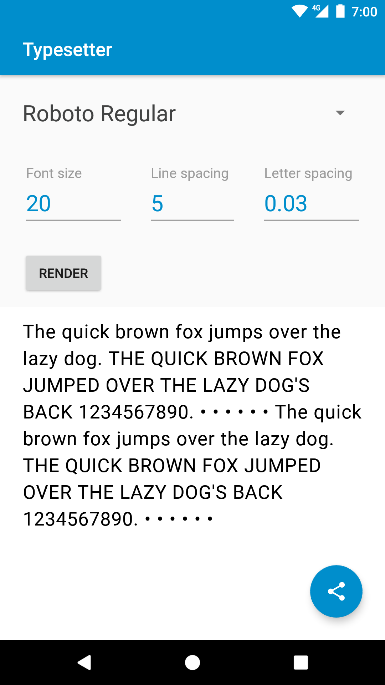

# Typesetter

Tool to help nail down text styles when beginning a project. Change the values and hit render to see them modify the text below. Use the share button to automatically take a screenshot and share.

Current list of fonts:
 * Alegreya Regular
 * Lato Regular
 * LibreBaskerville Bold
 * Montserrat Medium
 * OpenSans Light
 * Roboto Regular
 * RobotoSlab Bold

Add any extra fonts to `app/src/main/assets/fonts/` and run to see them in the dropdown.

